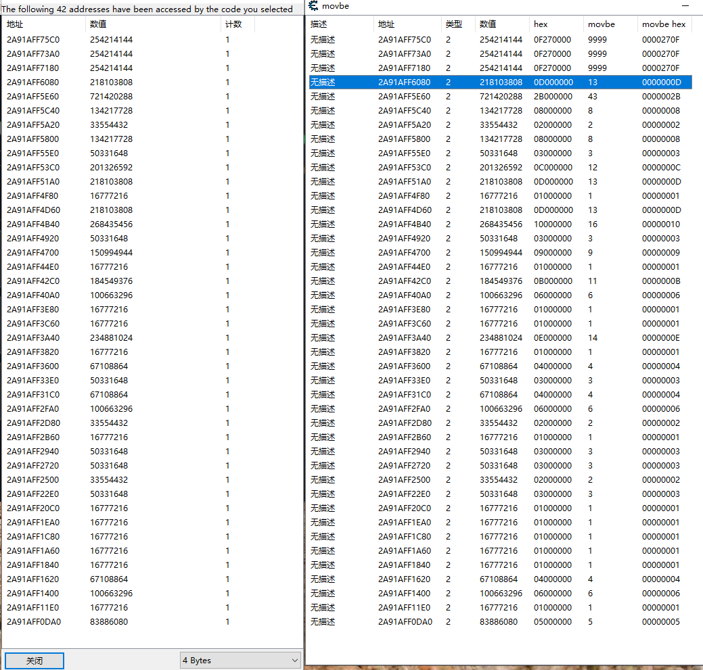

将lua文件放在autorun文件夹下，重启Cheat engine使用.

## timer 在脚本中简单的使用计时器

每隔100毫秒执行一次:
```
{$lua}
if syntaxcheck then return end

[ENABLE]
local addr = 0x2001DCD8
id = setInterval(function()
  writeInteger(addr , readInteger(addr)+1)
end, 100)

[DISABLE]
clearInterval(id)
```

延迟100毫秒，然后只执行一次:
```
{$lua}
if syntaxcheck then return end

[ENABLE]
local addr = 0x2001DCD8
id = setTimeout(function()
  writeInteger(addr , 999999)
end, 100)

[DISABLE]
```

## movbe 对应asm的`movbe`指令

在地址列表上添加右键菜单movbe选项，在新的视图中查看转换后的值

通常这个值的类型为4字节




## autorunMonoMethod
激活mono，并自动编译jit函数
```
{$lua}
  if syntaxcheck then return end
  _checkMonoMethod('PlayerAttribute', 'set_currentEnergy')
{$asm}
```

## getJmpNewBytes
获取新的跳转字节集
```
local newJmpBytes = getJmpNewBytes(0x008E05AE, 0x01350000, 5, { 0xE9 })
writeBytes(0x008E05AE, r)
```

- dump(table): nil  打印table
- GetParent(hwnd): hwnd 获取窗口的父窗口 https://docs.microsoft.com/en-us/windows/win32/api/winuser/nf-winuser-getparent
- getTargetWindow(): hwnd 获取目标的进程的顶级窗口句柄
- getTargetWindowRect(): RECT 获取目标窗口的信息 https://docs.microsoft.com/en-us/windows/win32/api/winuser/nf-winuser-getwindowrect
- getWindowTextW(hwnd): string 获取宽字符标题 https://docs.microsoft.com/en-us/windows/win32/api/winuser/nf-winuser-getwindowtextw
- targetWindowIsTop(): bool 如果目标进程在最顶层返回true，否则返回false
- getTargetFilePath(): string  返回目标进程在文件中的路径 C:\Users\ajanuw\Desktop\game2.exe
- getTargetFileDir(): string   返回目标进程在文件中的目录 C:\Users\ajanuw\Desktop\
- isInjectPluginDLL(): bool 是否注入了 CE_Plugin.dll
- dumpProps(obj): void  打印一个对象的属性列表
- dumpComps(obj): void  打印子组件的名称列表
- exitWindowsEx(number val): bool  0关机 1重启 2注销 